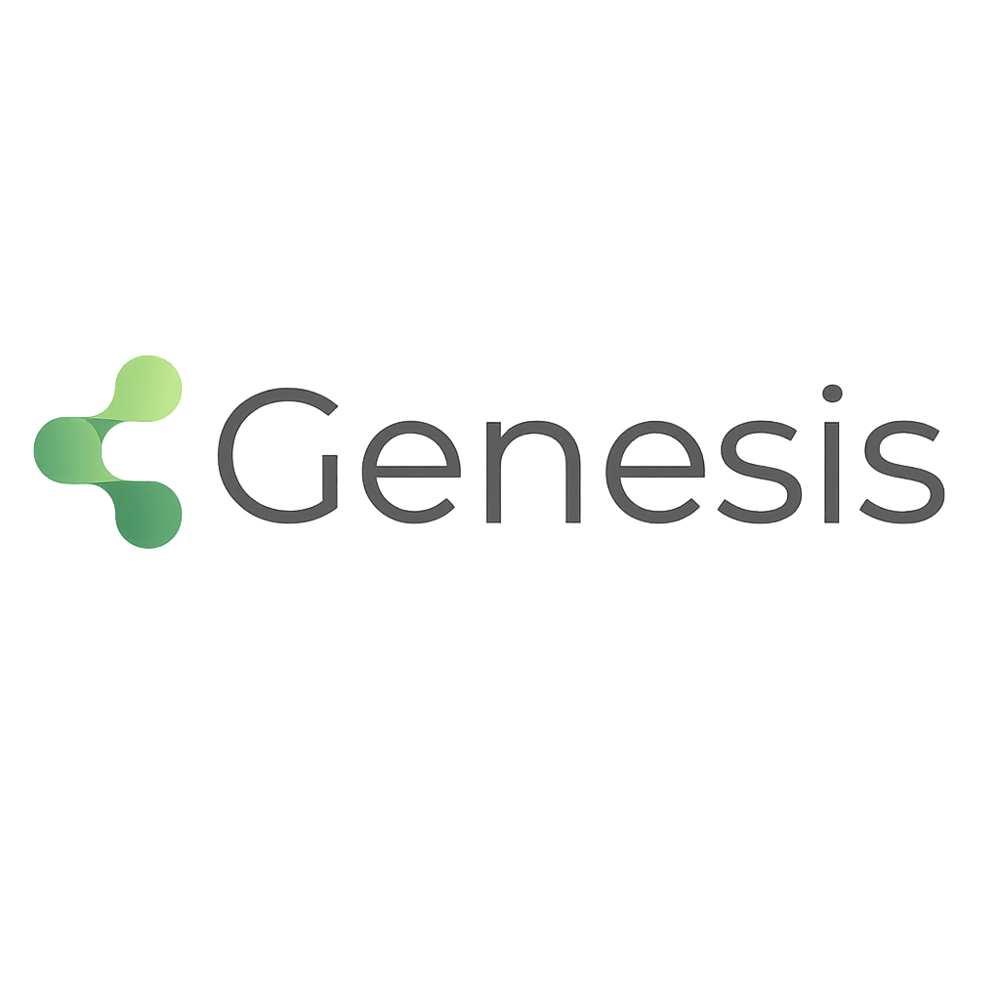

# Genesis — Redução de No-show & Eficiência de Agenda · Mater Dei

> MVP desenvolvido para o Enterprise Challenge FIAP — Saúde Conectada (Semestre 2, Sprint 3).

## Sobre o projeto

**Genesis** é um dashboard analítico que combina diagnóstico de causa-raiz, modelo preditivo de risco de no-show e plano de ação operacional para equipes de agendamento hospitalar. A premissa é direta: saber *quem tem maior chance de faltar*, *por quê* e *o que fazer antes que isso aconteça* — com o canal e o timing certo para cada nível de risco.

O sistema foi treinado sobre +110 mil consultas reais e entrega uma fila de trabalho priorizada por risco (baixo → SMS 24h antes / moderado → WhatsApp 48h antes / alto → ligação 72h antes), reduzindo no-show sem aumentar proporcionalmente o esforço operacional. O ROI estimado está disponível em tempo real no próprio dashboard.

## Como rodar

```bash
pip install -r requirements.txt
streamlit run app/dashboard.py
```

> **Pré-requisito:** coloque o CSV do Kaggle ([Medical Appointment No Shows](https://www.kaggle.com/datasets/joniarroba/noshowappointments)) em `data/raw/noshowappointments.csv`

## Estrutura do dashboard

| Aba | O que mostra |
|---|---|
| **Executive Overview** | KPIs de no-show, perda financeira estimada, simulador de ROI |
| **Reveal** | Diagnóstico: onde está o no-show (canal, bairro, antecedência, faixa etária) |
| **Predict** | Modelo preditivo: score individual de risco + exemplo prático do caso mais urgente |
| **Act** | Fila operacional: protocolo por faixa de risco, custo vs perda evitável, export CSV |

## Métricas do modelo (RandomForestClassifier · class_weight=balanced)

| Métrica | Valor típico | O que significa |
|---|---|---|
| **AUC** | ~0.73 | Acerta a ordem de risco entre 2 pacientes aleatórios 73% das vezes |
| **F1-score (no-show)** | ~0.24 | Equilíbrio precisão/recall para a classe "faltou" (threshold 0.5) |
| **Precisão** | ~0.46 | Dos marcados como alto risco, ~46% realmente faltam |
| **Recall** | ~0.16 | O modelo identifica ~16% dos que faltam ao threshold padrão (0.5) |

> Os valores exatos variam conforme o período e filtros selecionados no dashboard.
> AUC 0.72 é suficiente para **priorizar intervenções** — o objetivo não é prever com certeza absoluta, mas ordenar quem acionar primeiro.

## Features do modelo

- Idade e faixa etária (60+)
- Canal de confirmação (SMS vs sem SMS)
- Bairro (proxy de distância/acesso)
- Antecedência em dias e minutos
- **Hora do agendamento** (nova)
- **Dia da semana da consulta** (nova)
- **Histórico de no-show do paciente** — quantidade de faltas anteriores (nova, maior preditor)

## Screenshot



## Vídeo pitch

[](https://www.youtube.com/watch?v=05B4c4QaIzg)

## Tecnologias

- Python 3.11+
- Streamlit 1.37
- scikit-learn 1.5 (RandomForestClassifier)
- Plotly 5.23
- Pandas / NumPy
